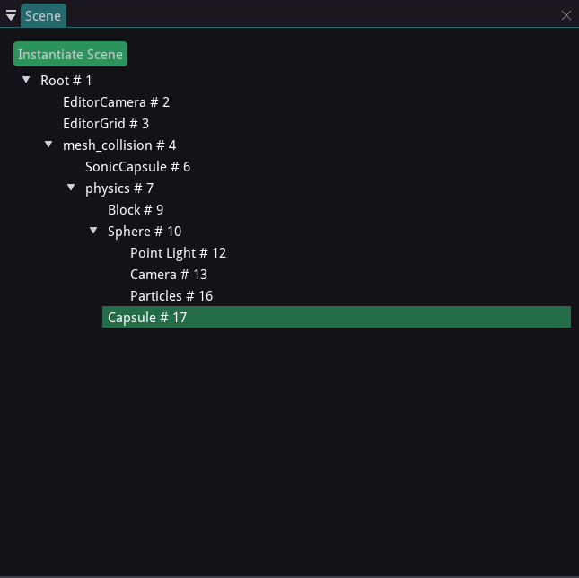

Editor Layout
=============

The main editor area is laid out in 6 major sections.

Toolbar Dock
============

.. image:: images/toolbar_dock.png
	:alt: Toolbar Dock
	:align: center

The toolbar dock displays different settings that affect the editor's view of the game world and modify the Rootex Engine's overall state.

You can find data related to the Editor FPS, registered Events in the EventManager, the current camera being used to view the world, etc. You can try fiddling with the settings here to know what each thing does. The toolbar dock also allows playing the currently open level in game or play the game from the original starting level as defined in the game settings.

Output Dock
===========

.. image:: images/output_dock.png
	:alt: Output Dock
	:align: center

The output dock is the Rootex Engine's channel to report stuff happening internally in the engine and in the editor. You can expect to see error messages, warnings and plain reports in the output dock. You will also notice a text input bar at the bottom of the output dock.

Use the command input to run Lua code in Rootex's Lua VM. All of Rootex's scripting API is available through this command line.

Viewport Dock
=============

.. image:: images/viewport_dock.png
	:alt: Viewport Dock
	:align: center

The viewport dock provides the view into the game world through the eyes of an entity called the EditorCamera. The EditorCamera is an editor-only entity. Viewing the game world in the editor also enables a few perks that are only accessible in the editor and not the game. The view mode for the game world can be changed using the View main menu, usually present at the top of the window, alongside the File main menu and others.

************
EditorCamera
************

The EditorCamera is an editor-only entity which is setup to be the view of the editor into the game world.

To view the world though EditorCamera, select EditorCamera as the current camera entity from `Viewport > Current Camera`. The EditorCamera can be controlled from the editor by holding Right Mouse Button and using WASD/Space/Shift to move. You can tweak the camera turning speed and the moving speed.

*****
Gizmo
*****

The 3D gizmo is an editor-only tool to let the user change the position, rotation, and scale of selected entity in either local or world space. Scenes can be selected from the scene dock.

The gizmo has 3 separate modes of working.

* Translation

In this mode the gizmo takes the shape of 3 axes point in orthogonal directions. These axes are selectable with the mouse pointer and position of entities can be altered by dragging.

* Rotation

In this mode the gizmo takes the shape of 3 circles with their axes going in orthogonal directions. These circles denote the rotation of the entities in Euler angles and rotation of the entities can be altered by dragging.

* Scale

In this mode the gizmo takes the shape of 3 axes in orthogonal directions. These axes denote the scales which can be altered by dragging.

The gizmo has 2 modifiers to each of the modes. The Local modifier will apply changes in the local coordinate system. The World modifier will apply changes in the world coordinate system.

**********
EditorGrid
**********

There is one more editor-only entity that is helpful to the viewport. The EditorGrid displays the grid defined by the grid cells sizes. You can alter the grid settings by selecting EditorGrid in the scene dock.

Scene Dock
==============

The scene dock displays the parent-child hierarchy of scenes in the current game world.

The hierarchy between scenes is defined by the Scene class and its children. Scenes can be selected by clicking on their name in the scene dock. You can also change the hierarchy between scenes by dragging and dropping the scene over your chosen parent scene.

Inspector Dock
==============

.. image:: images/inspector_dock.png
	:alt: Inspector Dock
	:align: center

Inspector dock is the main hub of all data related to components in an entity. Data under each component is available for change using the inpector dock. Use the scene dock, or click on the scene in the viewport to select them.

Inspector dock also allows changing the name of the scene, attaching Lua scripts, adding or changing or removing components, resetting inter-component linkages and deleting entities, along with instantiating new scenes as children from files and saving scenes to files.
