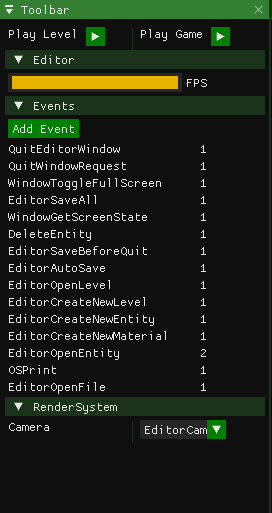
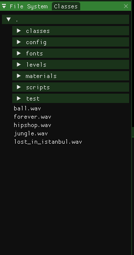
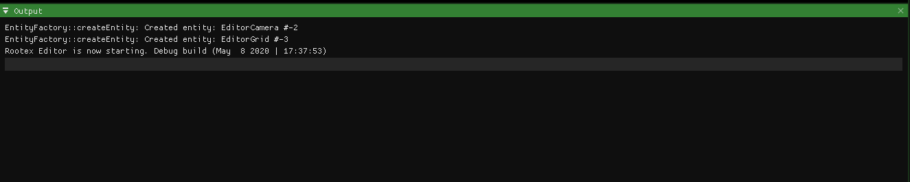
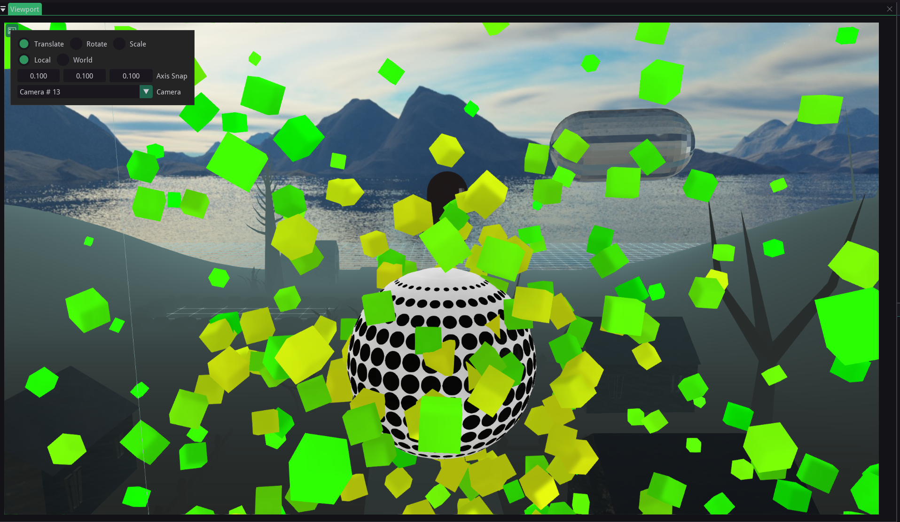
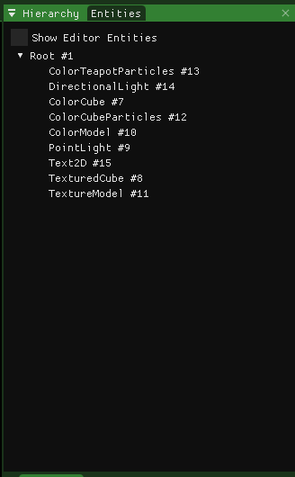
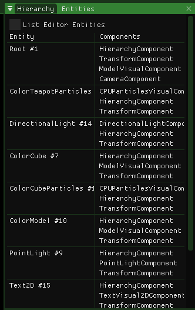
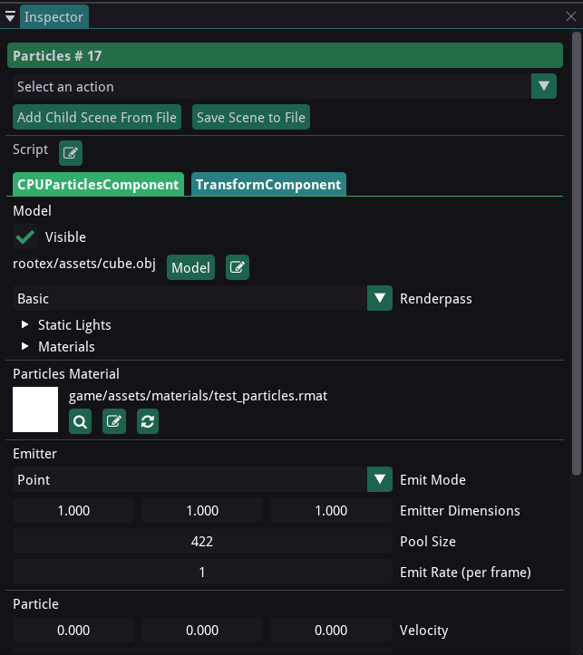

Editor Layout
=============

The editor features a Window application like series of main menu sections.

The main editor area is laid out in 6 major sections.

Toolbar Dock
============

The toolbar dock displays different settings that affect the editor's view of the game world and modify the Rootex Engine's overall state.

You can find data related to the Editor FPS, registered Events in the EventManager, the current camera being used to view the world, etc. You can try fiddling with the settings here to know what each thing does. The toolbar dock also allows playing the currently open level in game or play the game from the original starting level as defined in the game settings.

File System Dock
================

The file system dock displays the public file system starting from the directory "game/assets/".

All file paths that:

* Rootex handles internally 
* the user is required to use while using the Rootex Scripting API

are calculated from the root of the engine directory a.k.a. the directory having the Rootex LICENSE file.

You can also drag and drop files onto specific areas in the Inspector Dock and the Hierarchy Dock to ease assigning resources to different game objects.

Output Dock
===========

The output dock is the Rootex Engine's channel to report stuff happening internally in the engine and in the editor. You can expect to see error messages, warnings and plain reports in the output dock. You will also notice a text input bar at the bottom of the output dock. This text input bar is the CLI access to the Rootex Engine.

Currently the command line only allows emitting command events (using the engine's Event Manager) which take a single string input. Support for other commands are slowing being added in.

Viewport Dock
=============

The viewport dock provides the view into the game world through the eyes of an entity called the EditorCamera. The EditorCamera is an editor-only entity. Viewing the game world in the editor also enables a few perks that are only accessible in the editor and not the game. The view mode for the game world can be changed using the View main menu, usually present at the top of the window, alongside the File main menu and others.

************
EditorCamera
************

The EditorCamera is an editor-only entity which is setup to be the view of the editor into the game world.

To view the world though EditorCamera, select EditorCamera as the current camera entity from Toolbar > Camera. The EditorCamera can be controlled from the editor by holding Right Mouse Button and using WASD/Space/C to move. You can tweak with the camera turning speed and the moving speed with the controls on the top left of the viewport.

*****
Gizmo
*****

The 3D gizmo is an editor-only tool to let the user mess with the position and rotation of selected entity. Entities can be selected from the hierarchy dock.

The gizmo has 2 separate modes of working.

* Translation

In this mode the gizmo takes the shape of 3 axes point in orthogonal directions. These axes are selectable with the mouse pointer and position of entities can be altered by dragging.

* Rotation

In this mode the gizmo takes the shape of 3 circles with their axes going in orthogonal directions. These circles denote the rotation of the entities in Euler angles and roation of the entities can be altered by dragging.

The gizmo has 2 modifiers to each of the modes. The Local modifier will apply changes in the local coordinate system. The World modifier will apply changes in the world coordinate system.

**********
EditorGrid
**********

There is one more editor-only entity that is helpful to the vierport. The EditorGrid displays the grid defined by the grid cells sizes. You can alter the grid settings by selecting EditorGrid in the hierarchy dock.

Hierarchy Dock
==============

The hierarchy dock displays the parent-child hierarchy of entities in the current game world.

The hierarchy between entities is defined by the HierarchyComponent. Entities can be selected by clicking on the entity name in the hierarchy dock. You can also change the hierarchy between entities by dragging and dropping the entity over your chosen parent entity.

Entities Dock
=============

The entities dock simply lists the entities present in the current level, alongwith a list of components that are attached to a particular entity.

Inspector Dock
==============

Inspector dock is the main hub of all data related to components in an entity. Data under each component is available for change using the inpector dock. Use the hierarchy dock or the entities dock to select entities. 

Inspector dock also allows changing the name of the entity, adding or removing components, resetting inter-component linkages and deleting entities.
