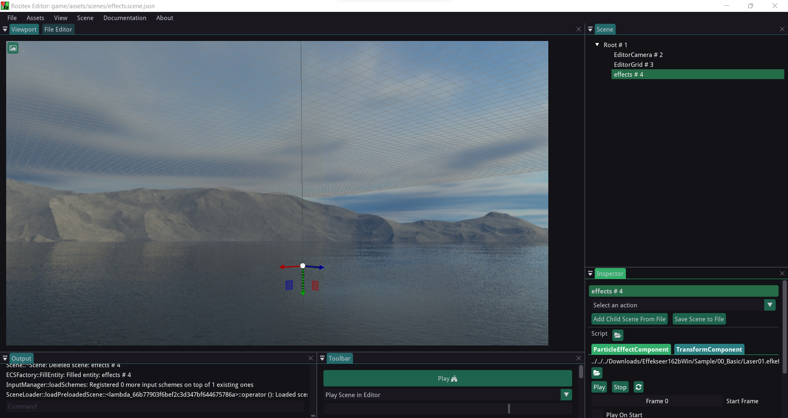
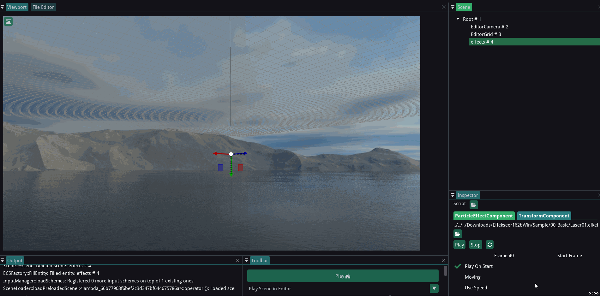
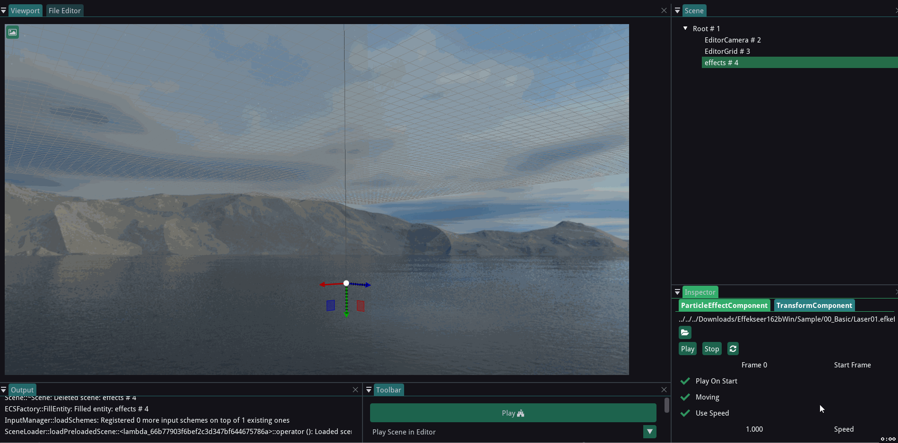

============================================
Making effects using ParticleEffectComponent
============================================

ParticleEffectComponent in Rootex can be used to make awesome particle effects!

Effekseer
---------

The ParticleEffectComponent makes use of `Effekseer <https://effekseer.github.io/en/>`_. Effekseer is a particle effect creation tool which can export the effect as an ``*.efkefc`` file.

This ``*.efkefc`` file is used by the ParticleEffectComponent in Rootex to import the effects.

You can follow the `documentation <https://effekseer.github.io/en/documentation.html>`_ and `tutorial <https://effekseer.github.io/en/documentation.html#tutorial_sec>`_ of Effekseer to know how to create effects using it.

Using the Effekseer exports (Demo)
----------------------------------

Let's start by creating an empty scene and adding the TransformComponent and ParticleEffectComponent to it.

We have added a demo effect which we get bundled with Effekseer 1.62b (Laser01.efkefc). To get this effect, download `Effekseer 1.62b <https://effekseer.github.io/en/download.html>`_, unzip it and you'll find the effect in Sample/00_Basic/ of the unzipped folder.

Add the effect by going to your scene's ParticleEffectComponent in the Inspector and clicking on the folder icon to select the file.

We have tweaked the `EditorCamera <https://rootex.readthedocs.io/en/latest/guides/editor_layout.html#editorcamera>`_ to get a better view of the scene.

Explanation of options:

- Play : Plays the loaded effect

- Stop : Stops the playing effect

- Play On Start : Sets whether to play the effect at editor and game start or not.

- Start Frame : Sets the frame from which effect starts.

- Moving : Sets if the effect moves with the transform component once playing.

- Use Speed : Running the effect at a user defined spped. Default speed is 1.

While Play, Stop and Play On Start are pretty self-explanatory, The following explains the other options.

Start Frame
-----------

An example with Start Frame as Frame 0

.. image:: images/Frame0start.gif

An example with Start Frame as Frame 40

In the 2nd example it is visible that the effect starts after skipping the initial part of the first example.

Moving
------

An example with Moving off

.. image:: images/movingoff.gif

An example with Moving on

.. image:: images/movingon.gif

Use Speed
---------

At speed 1

At speed 0.1

.. image:: images/speed0.1.gif
