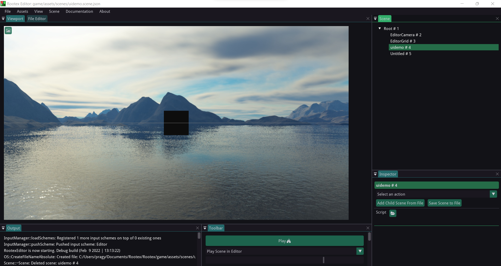
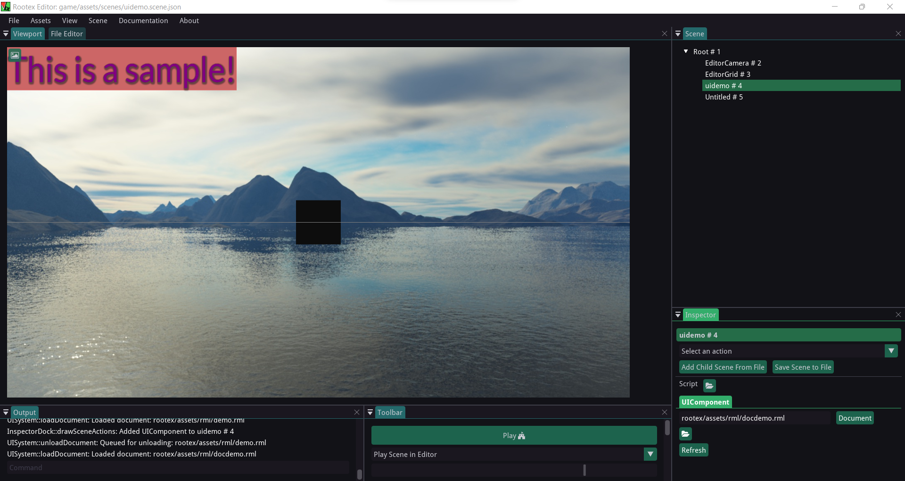
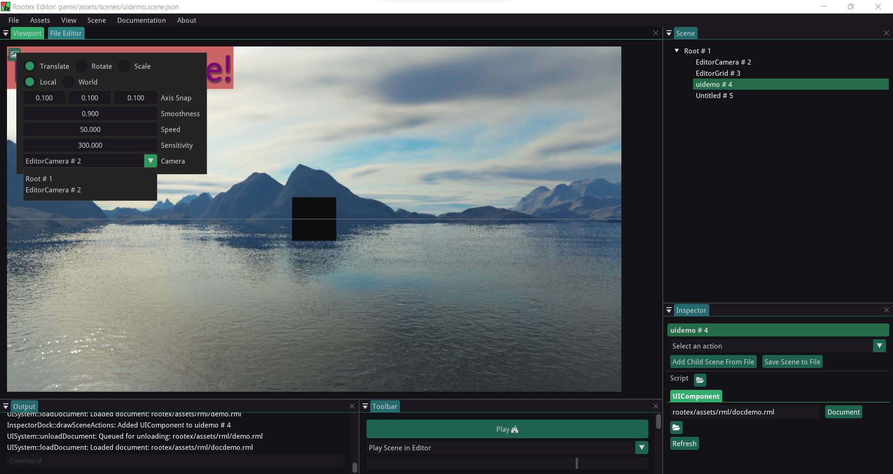
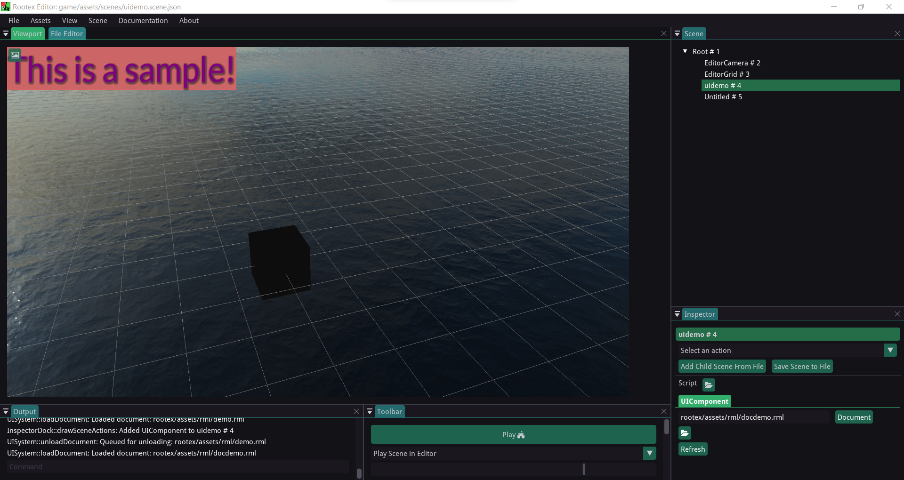

=============================
Making HUD using UI-component
=============================

UI creation is quite easy in Rootex. The UI-component spans the viewport and is not affected by the camera transform, so it can act be used for creating HUD, Menus etc.

RmlUi
-----

The UI-component makes use of RmlUi. RmlUi is a C++ UI library based on the HTML and CSS standards.
It contains of **RML** (based loosely around XHTML 1.0 and HTML 4.01) and **RCSS** (based on CSS2).

`RmlUi Documentation <https://mikke89.github.io/RmlUiDoc/>`_

`RmlUi Source <https://github.com/mikke89/RmlUi>`_

Basic HUD
---------

Let's create an empty scene.

Add a UIComponent to this scene

Make an empty scene with a TransformComponent and ModelComponent (basic cube)

Now add the following RML script to the UIComponent

.. code-block:: html
    :linenos:

        <rml>
        	<head>
        		<title>Demo</title>
        		
            </head>
            <body>
        		
This is a sample!

            </body>
        </rml>

This will add sample text to the top left of our viewport which will react on mouse hover.

Upon playing this scene and switching to EditorCamera, when we move the EditorCamera around, we can see the view of the cube changing, but the HUD stays in place.

Fade-In effect
--------------

We can also make a simple fade-in effect.

RML code:

.. code-block:: html
    :linenos:

        <rml>
            <head>
                <title>Transition</title>
                
            </head>
            <body>
            </body>
        </rml>

Upon loading this in the UIComponent of our scene, a fade effect will trigger and the scene will go black.

.. image:: images/fade.gif
