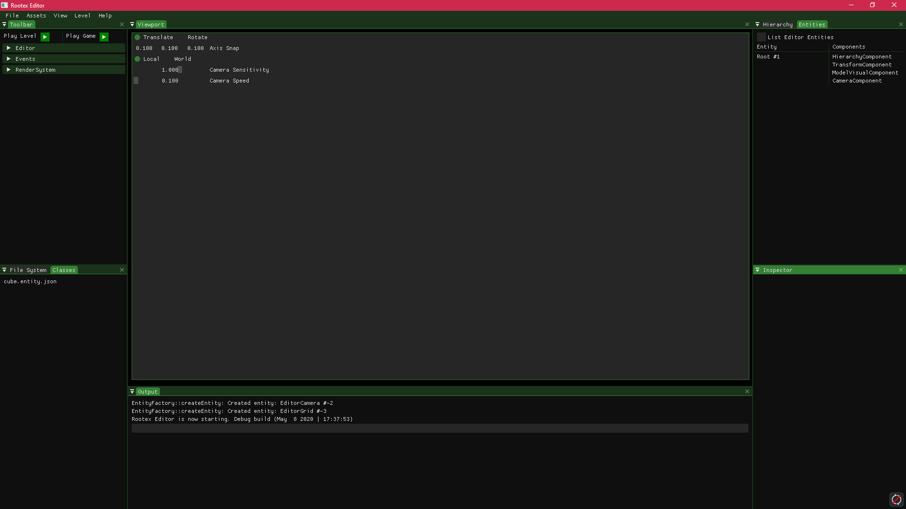

Rootex Editor
==================

Rootex comes with a separate editor for making games, called the Rootex Editor.

Rootex Editor is built using `Dear ImGui <https://github.com/ocornut/imgui>`_ . The editor UI is subject to change but the overall workings shall remain the same.

Running the Editor
==================

1. Run the editor by opening the editor executable.

2. Once editor is open you are greeted by the editor UI.

3. Try to open a level from the File menu > Open Level option.

.. note::
	If you get an error along the lines of ``dxgidebug.dll not loaded`` while opening the executable, install **Graphics Tools** by following this `guide <https://docs.microsoft.com/en-us/windows/uwp/gaming/use-the-directx-runtime-and-visual-studio-graphics-diagnostic-features>`_.
