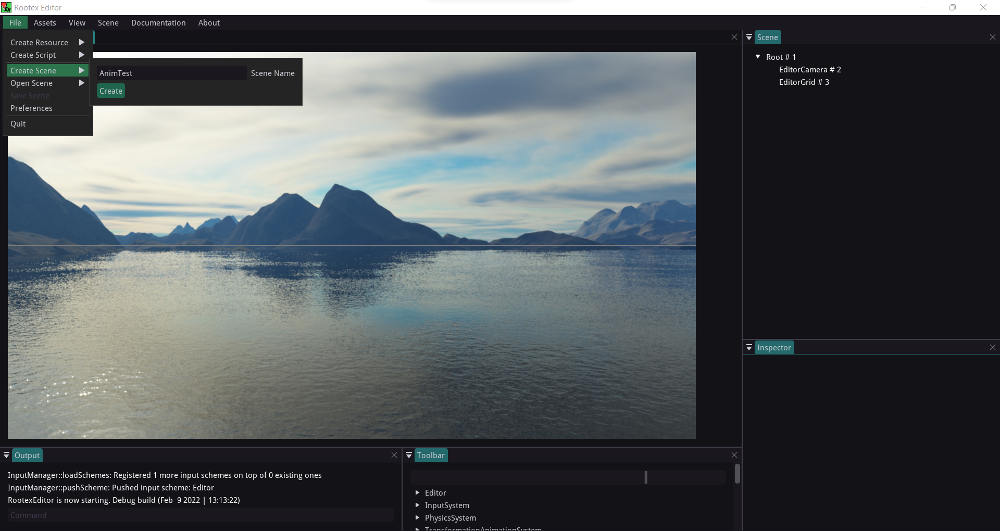
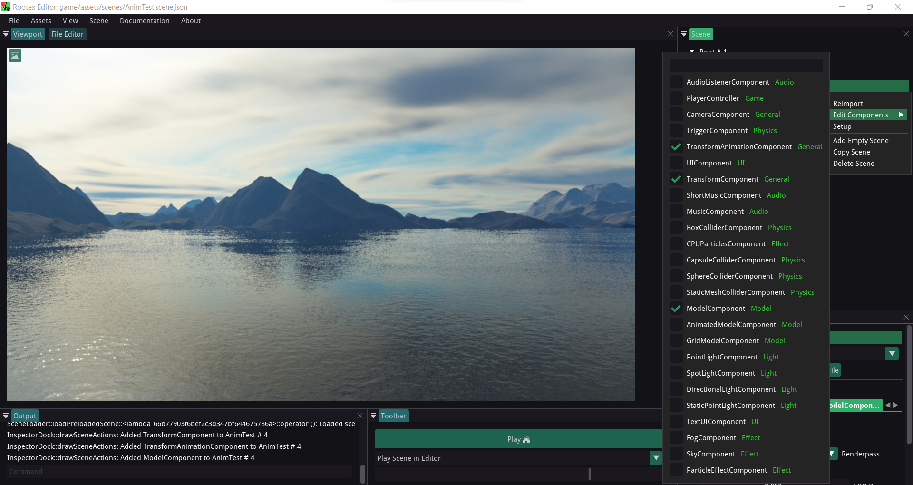
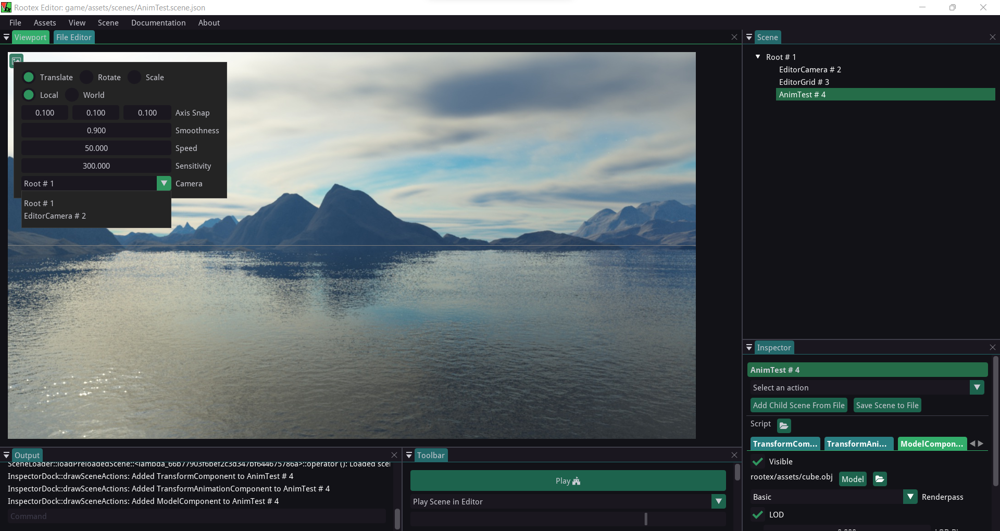
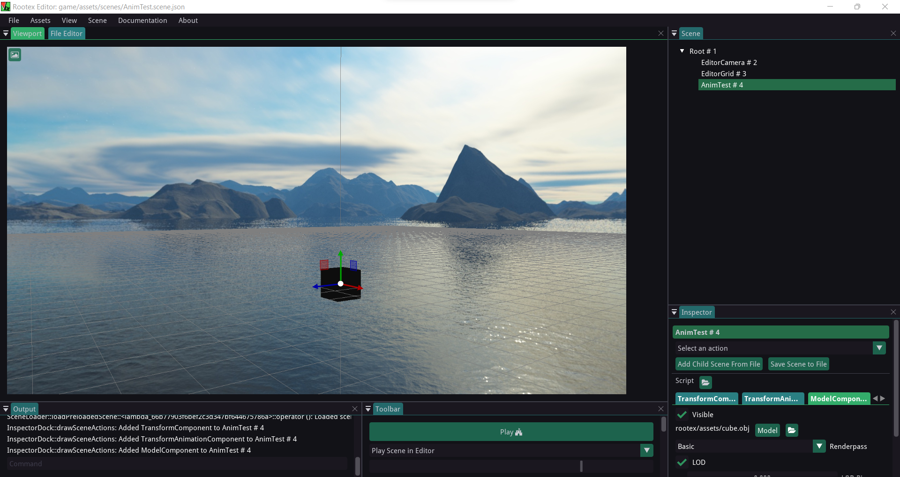
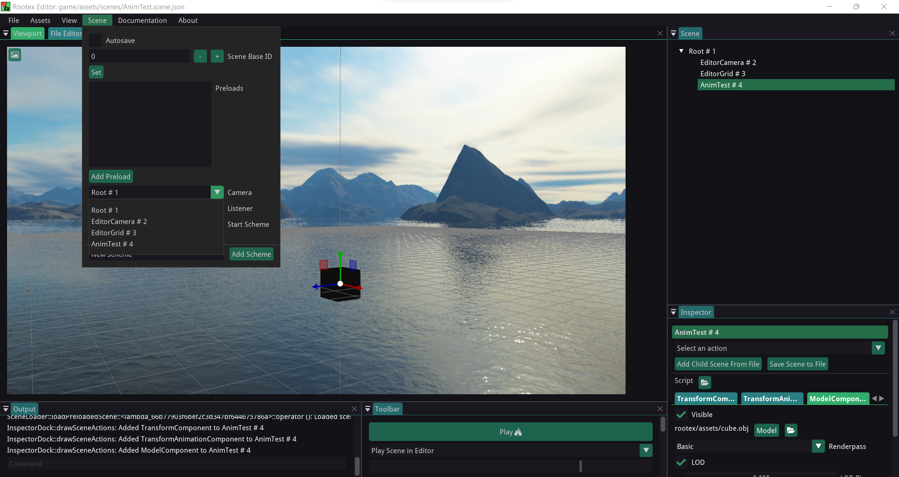
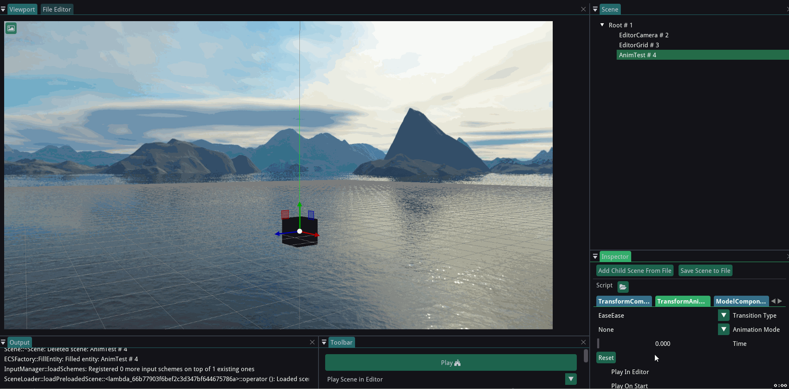
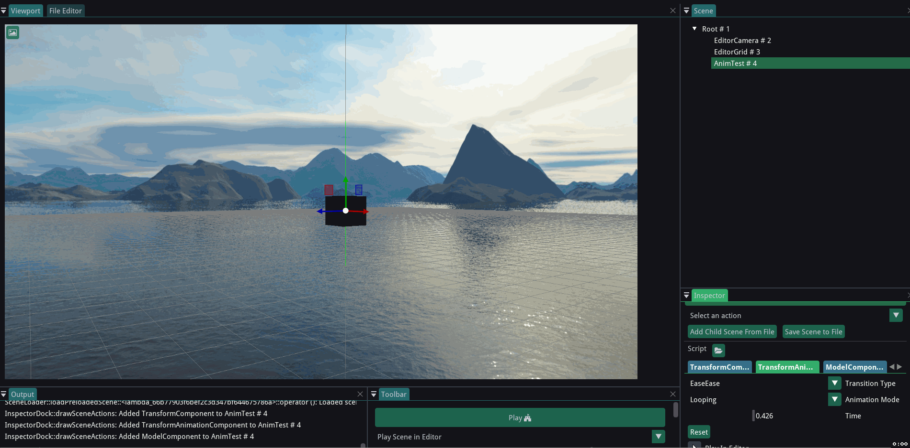
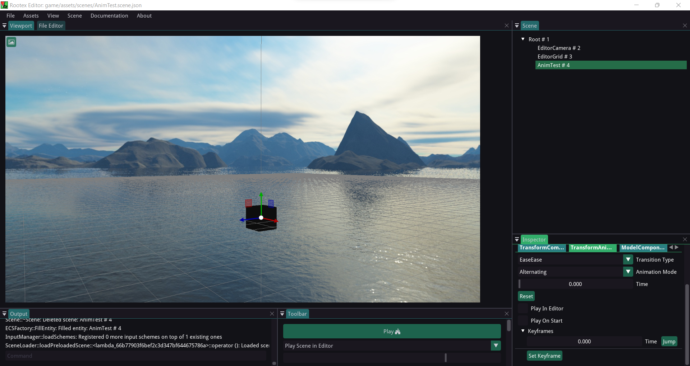
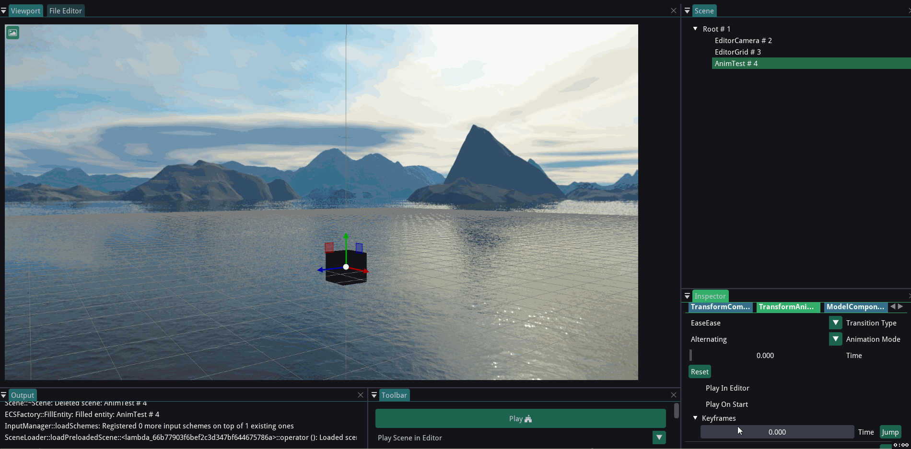
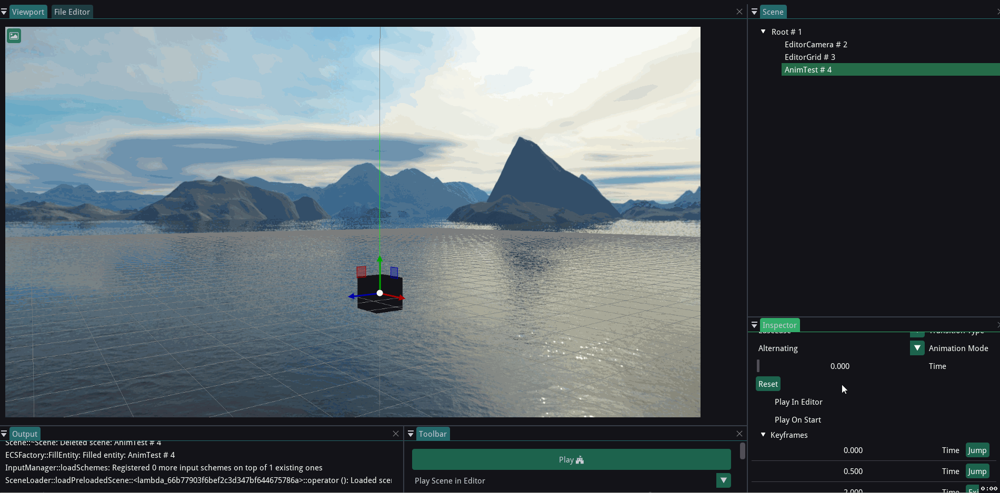

===================================================
Animating Objects using TransformAnimationComponent
===================================================

TransformAnimationComponent can be used to easily animate scenes which have to be animated endlessly without relying on scripting for the same.

It is quite easy to as it uses a keyframe based interface to achieve this.

Setting up
----------

Create a new scene and assign the TransformComponent, ModelComponent and TransformAnimationComponent to it.

Creating a new scene:

Adding the Components by right clicking on the scene in inspector:

Select the EditorCamera:

Set the camera to EditorCamera and position it such that it has a good view of the scene.

Select the EditorCamera as default camera for the scene.

Interface
---------

* Transition Type : How the transition must be between keyframes. Explaining the options:

  - SmashSmash : Abrupt start and end transition
  - EaseEase : Smooth start and end transition
  - SmashEase : Abrubt start and smooth end transition
  - EaseSmash : Smooth start and abrupt end transition

* Animation Mode : How the animation should play. Explaining the options:

  - Looping : Animation plays from Start time to End time unidirectionally.
  - Alternating : Animation plays from Start time to EndTime and then reverses from End time to Start time.

* Time : Shows the time while animation plays

* Reset : resets the animation

* Play in Editor : Play the animation in editor

* Play on start : Play the animation when game starts

* Keyframes : To set the animation keyframes

  - Set Keyframe : To add a new keyframe at the end
  - Pop Keyframe : To remove the last keyframe

Transition Type
---------------

Examples of different transition types for better understanding.

SmashSmash:

.. image:: images/SmashSmash.gif

EaseEase:

.. image:: images/EaseEase.gif

SmashEase:

.. image:: images/SmashEase.gif

EaseSmash:

.. image:: images/EaseSmash.gif

Animation Mode
--------------

Showing demo of each mode for better understanding.

None: Animation plays only once.

Looping: Animation plays unidirectionally and repeats afteer ending.

.. image:: images/AnimLoop.gif

Alternating: Animation plays back and forth (bidirectionally).

.. image:: images/AnimAlt.gif

Check the time progressbar for more clarity.

Reset
-----

Resets the animation to the starting frame (Time 0.00).

Play in Editor
--------------

Plays the Animation in EditorView.

.. image:: images/AnimEditor.gif

Play on Start
-------------

Plays the Animation on game start.

Keyframes
---------

Open the keyframes dropdown to get a list of keyframes.

Each keyframe has a timestamp and a jump button.

More keyframes can be added using the Set Keyframe Button. For now We will have 3 Keyframes.

Now, to animate any object, we need to set it to its desired location for a given keyframe and specify the time in the keyframe.

Let's see how.

For example, if I want our object to move up to X,Y = 0,5 and have a certain rotation at 0.5 sec of our rotation:

What I did here is entered a Keyframe using the **Jump** button next to it, gave the object its new Transform values (which I want at that keyframe), set the transform using the **exit jump** button and gave it a timestamp of 0.5 sec.

Setting Another Keyframe.

Playing the Animation:

.. image:: images/AnimPlay.gif

Popping a Keyframe removes the last keyframe.

Playing after popping the last keyframe:

.. image:: images/AnimPop.gif

This way, more keyframes can be added using **Set Keyframe** to add more steps to the animation or keyframes can be removed using **Pop Keyframe**.